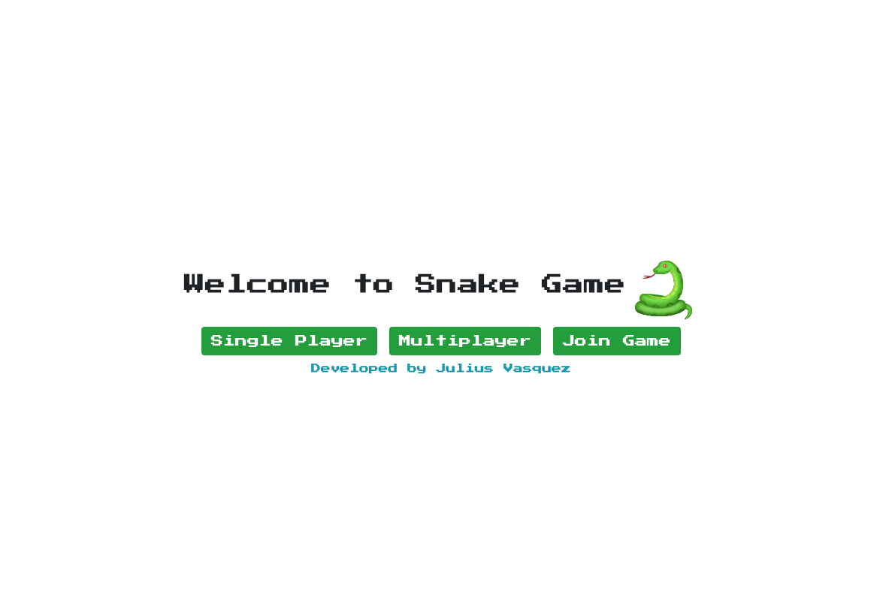

# React Snake Game

A simple multiplayer snake game built with [ReactJS](https://reactjs.org/) and [Socket.IO](https://socket.io/)
This project was bootstrapped with [Create React App].(https://github.com/facebook/create-react-app).



<!-- TABLE OF CONTENTS -->
<details open="open">
  <summary>Table of Contents</summary>
  <ol>
    <li>
      <a href="#technologies">Technologies</a>
    </li>
    <li>
      <a href="#installation">Installation</a>
      <ul>
        <li><a href="#installation">Installation</a></li>
      </ul>
    </li>
    <li>
      <a href="#running-the-game">Running the game</a>
      <ul>
        <li><a href="#to-play-locally">Play locally</a></li>
        <li><a href="#to-play-online">Play online</a></li>
      </ul>
    </li>
    <li><a href="#development">Development</a></li>
    <li><a href="#deployment">Roadmap</a></li>
    <li><a href="#contact">Contact</a></li>
  </ol>
</details>


## Technologies

These are the core technologies & libraries used in the project.
- ReactJS - Javascript library to handle the reactivity of the data
- React Context - Used as a state management for every player
- Socket.IO - To handle bi-directional communication between multiple players.
- HTML5 & CSS3 - For displaying the main snake board game and page styling
- Typescript - Static typing 
- Github Pages - To host the client app
- Heroku - To host the websocket server

## Installation

```bash
# Clone this repository
$ git clone https://github.com/juvsqz/react-snake-game

# Go into the project folder
$ cd react-snake-game

# Install dependencies
$ yarn install


```


## Running the game
The game can be played locally and online. Currently, it supports 3 users for multiplayer game.

### To play locally
```bash
# This command will start the client and server project.
# The application will automatically open in the browser
$ yarn start

```

### To play online
Simply visit the <https://juvsqz.github.io/react-snake-game/> and play the game.


## Development

### Available Scripts

| Command        | Description                                                                                                                                                                                                                                                       |
| :------------- | :---------------------------------------------------------------------------------------------------------------------------------------------------------------------------------------------------------------------------------------------------------------- |
| `yarn install` | Install project dependencies                                                                                                                                                                                                                 |
| `yarn start`   | Runs the client and server in the development mode.<br /> Opens [http://localhost:3000](http://localhost:3000) to view it in the browser. <br> The page will reload if you make edits.                                                                                           |
| `yarn build`   | Builds the app for production to the `build` folder.<br /> It correctly bundles React in production mode and optimizes the build for the best performance.<br/>The build is minified and the filenames include the hashes.<br /> The app is ready to be deployed! |
| `yarn build:server`   | Builds the server for production to the `build` folder |


## Deployment
| Command        | Description                                                                                                                                                                                                                                                       |
| :------------- | :---------------------------------------------------------------------------------------------------------------------------------------------------------------------------------------------------------------------------------------------------------------- |
| `yarn deploy` | Deploy the client app to the github pages.                                                                                                                                                                                                            |
| `git push heroku master`   | Deploys the server applicatiom                                                                                         |

## Contact
If you want to contact me you can reach me at juvsqz@gmail.com


